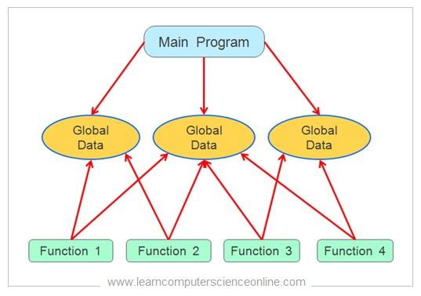

# Exercise 2 - Solutions

The following solutions come in 2 variants.
One is the complete code file, the other is a comparison between the previous solution (1a), and the new one (1b). The comparison lets you see what was added, and what was removed.

Tip: Hold `Ctrl` + `Left Click` to open the links in a new tab.

## How this program is structured

## Simulation

https://wokwi.com/projects/368604124891332609

## Final solutions

- [Without structs](./5/5.ino)
- [With structs](./5-structs/5-structs.ino)

## Comparisons

The ones without links are not worth comparing with the previous version.

1b
-> [1c](https://diff-editor.vercel.app/?language=cpp&directory=https://raw.githubusercontent.com/nosknut/arduino-course-v2023/main/YR6018/Exercises/2/Basic/&file1=1b/1b.ino&file2=1c/1c.ino)
-> [1c-modulo](https://diff-editor.vercel.app/?language=cpp&directory=https://raw.githubusercontent.com/nosknut/arduino-course-v2023/main/YR6018/Exercises/2/Basic/&file1=1c/1c.ino&file2=1c-modulo/1c-modulo.ino)
-> [2b](https://diff-editor.vercel.app/?language=cpp&directory=https://raw.githubusercontent.com/nosknut/arduino-course-v2023/main/YR6018/Exercises/2/Basic/&file1=1c-modulo/1c-modulo.ino&file2=2b/2b.ino)
-> [2c](https://diff-editor.vercel.app/?language=cpp&directory=https://raw.githubusercontent.com/nosknut/arduino-course-v2023/main/YR6018/Exercises/2/Basic/&file1=2b/2b.ino&file2=2c/2c.ino)
-> [5](https://diff-editor.vercel.app/?language=cpp&directory=https://raw.githubusercontent.com/nosknut/arduino-course-v2023/main/YR6018/Exercises/2/Basic/&file1=2c/2c.ino&file2=5/5.ino)

3b1
-> [3b2](https://diff-editor.vercel.app/?language=cpp&directory=https://raw.githubusercontent.com/nosknut/arduino-course-v2023/main/YR6018/Exercises/2/Basic/&file1=3b1/3b1.ino&file2=3b2/3b2.ino)

4a1
-> [4a2](https://diff-editor.vercel.app/?language=cpp&directory=https://raw.githubusercontent.com/nosknut/arduino-course-v2023/main/YR6018/Exercises/2/Basic/&file1=4a1/4a1.ino&file2=4a2/4a2.ino)

4a3
-> [4b34](https://diff-editor.vercel.app/?language=cpp&directory=https://raw.githubusercontent.com/nosknut/arduino-course-v2023/main/YR6018/Exercises/2/Basic/&file1=4a3/4a3.ino&file2=4b34/4b34.ino)
-> [4b5](https://diff-editor.vercel.app/?language=cpp&directory=https://raw.githubusercontent.com/nosknut/arduino-course-v2023/main/YR6018/Exercises/2/Basic/&file1=4b34/4b34.ino&file2=4b5/4b5.ino)

## Files

- [1b](./1b/1b.ino)
- [1c](./1c/1c.ino)
- [1c-modulo](./1c-modulo/1c-modulo.ino)
- [2b](./2b/2b.ino)
- [2c](./2c/2c.ino)
- [3a](./3a/3a.ino)
- [3b1](./3b1/3b1.ino)
- [3b2](./3b2/3b2.ino)
- [4a1](./4a1/4a1.ino)
- [4a2](./4a2/4a2.ino)
- [4a3](./4a3/4a3.ino)
- [4b34](./4b34/4b34.ino)
- [4b5](./4b5/4b5.ino)
- [5](./5/5.ino)
- [5-structs](./5-structs/5-structs.ino)
