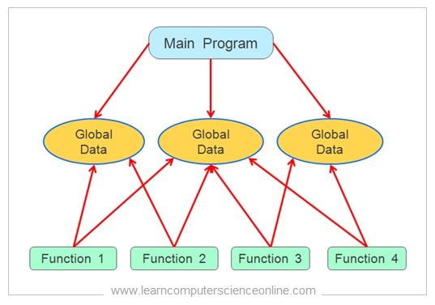

# Exercise 2 - Solutions

The following solutions come in 2 variants.
One is the complete code file, the other is a comparison between the previous solution (1a), and the new one (1b). The comparison lets you see what was added, and what was removed.

Tip: Hold ```Ctrl``` + ```Left Click``` to open the links in a new tab.

## How this program is structured


## Simulation
https://wokwi.com/projects/368049679345794049

## Final solutions
- [Without structs](./4cd/4cd.ino)
- [With structs](./4cd-structs/4cd-structs.ino)

## Comparisons
  1a
  ->  [1b](https://diff-editor.vercel.app/?language=cpp&directory=https://raw.githubusercontent.com/nosknut/arduino-course-v2023/main/YR6018/Exercises/2/Intermediate/&file1=1a/1a.ino&file2=1b/1b.ino)
  ->  [1c](https://diff-editor.vercel.app/?language=cpp&directory=https://raw.githubusercontent.com/nosknut/arduino-course-v2023/main/YR6018/Exercises/2/Intermediate/&file1=1b/1b.ino&file2=1c/1c.ino)
  ->  [2a](https://diff-editor.vercel.app/?language=cpp&directory=https://raw.githubusercontent.com/nosknut/arduino-course-v2023/main/YR6018/Exercises/2/Intermediate/&file1=1c/1c.ino&file2=2a/2a.ino)
  ->  [2b](https://diff-editor.vercel.app/?language=cpp&directory=https://raw.githubusercontent.com/nosknut/arduino-course-v2023/main/YR6018/Exercises/2/Intermediate/&file1=2a/2a.ino&file2=2b/2b.ino)
  ->  [2c](https://diff-editor.vercel.app/?language=cpp&directory=https://raw.githubusercontent.com/nosknut/arduino-course-v2023/main/YR6018/Exercises/2/Intermediate/&file1=2b/2b.ino&file2=2c/2c.ino)
  ->  [2d](https://diff-editor.vercel.app/?language=cpp&directory=https://raw.githubusercontent.com/nosknut/arduino-course-v2023/main/YR6018/Exercises/2/Intermediate/&file1=2c/2c.ino&file2=2d/2d.ino)
  ->  [3a](https://diff-editor.vercel.app/?language=cpp&directory=https://raw.githubusercontent.com/nosknut/arduino-course-v2023/main/YR6018/Exercises/2/Intermediate/&file1=2d/2d.ino&file2=3a/3a.ino)
  ->  [3b](https://diff-editor.vercel.app/?language=cpp&directory=https://raw.githubusercontent.com/nosknut/arduino-course-v2023/main/YR6018/Exercises/2/Intermediate/&file1=3a/3a.ino&file2=3b/3b.ino)
  ->  [4a](https://diff-editor.vercel.app/?language=cpp&directory=https://raw.githubusercontent.com/nosknut/arduino-course-v2023/main/YR6018/Exercises/2/Intermediate/&file1=3b/3b.ino&file2=4a/4a.ino)
  ->  [4b](https://diff-editor.vercel.app/?language=cpp&directory=https://raw.githubusercontent.com/nosknut/arduino-course-v2023/main/YR6018/Exercises/2/Intermediate/&file1=4a/4a.ino&file2=4b/4b.ino)
  ->  [4cd](https://diff-editor.vercel.app/?language=cpp&directory=https://raw.githubusercontent.com/nosknut/arduino-course-v2023/main/YR6018/Exercises/2/Intermediate/&file1=4b/4b.ino&file2=4cd/4cd.ino)

## Files
- [1a](./1a/1a.ino)
- [1b](./1b/1b.ino)
- [1c](./1c/1c.ino)
- [2a](./2a/2a.ino)
- [2b](./2b/2b.ino)
- [2c](./2c/2c.ino)
- [2d](./2d/2d.ino)
- [3a](./3a/3a.ino)
- [3b](./3b/3b.ino)
- [4a](./4a/4a.ino)
- [4b](./4b/4b.ino)
- [4cd](./4cd/4cd.ino)
- [4cd with structs](./4cd-structs/4cd-structs.ino)

